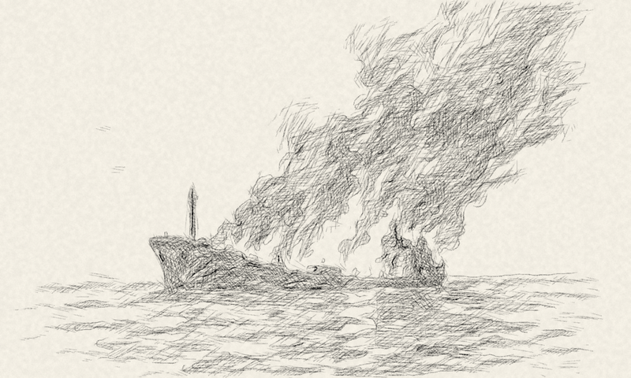
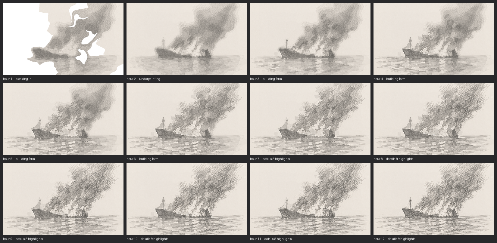
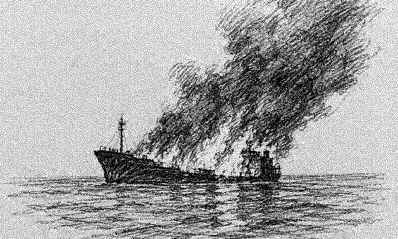

# A Day in Lines

An e-ink picture for the wall that draws itself. Give it any image, and over a day (12 hours by default, or whatever start and finish times you choose) a Raspberry Pi redraws it on the panel as a graphite pencil sketch, one stroke group at a time, 720 in all. Nothing is erased or redrawn, so anyone walking past sees a drawing in the middle of being made.

There are two paths, chosen with `--medium`: **drawing** (`--medium draw`, or `pencil`, the default) invents pencil marks for any image, as above, and **painting** (`--medium paint`) is for paintings. With `--medium paint`, give it a painting and it starts from a blank canvas and replays that painting stroke by stroke, big slabs of colour first, then smaller strokes, then details, ending on the picture you gave it. See [Painting instead of pencil](#painting-instead-of-pencil).




The sheet at each hour of the day ([full size](docs/contact_sheet.png)), and the finished frame as the 1-bit panel shows it ([e-ink](docs/final_eink.png)).

## How to run it

You need Python 3 with numpy, scipy, Pillow and scikit-image (scikit-image is needed for painting). On Raspberry Pi OS, `sudo apt install python3-numpy python3-scipy python3-pil python3-skimage`; elsewhere, `pip install -r requirements.txt`. Then, from the repo folder (`--image` is a picture, or a folder of pictures with a different one each day):

**1. Look at the result without any hardware.** Writes the finished picture, an hourly contact sheet and a timelapse into `preview/`:

```bash
python3 a_day_in_lines.py --image examples/tanker.png preview -o preview/                       # drawing
python3 a_day_in_lines.py --image my_painting.jpg --medium paint preview -o preview/            # painting
```

**2. Run it for real, still without a panel.** The clock runs on your computer and writes the current frame to `current.png` once a minute, with the viewer on http://localhost:8080 (the first run prints the address with the upload key):

```bash
python3 a_day_in_lines.py --image ~/pictures run --serve 8080                                   # drawing
python3 a_day_in_lines.py --image ~/paintings --medium paint run --serve 8080                   # painting
```

The first picture takes 30 to 60 seconds to process before anything appears (later ones are processed in the background). Add `--start 09:00 --end 17:00` to choose when each day's drawing begins and is finished (default: 07:00, over 12 hours). Stop it with Ctrl-C.

**3. Run it on a Waveshare e-ink panel** (Raspberry Pi; setup below). Try the panel first, then run:

```bash
export PYTHONPATH=~/e-Paper/RaspberryPi_JetsonNano/python/lib
python3 a_day_in_lines.py check --display waveshare:epd7in5_V2
python3 a_day_in_lines.py --image ~/pictures run --display waveshare:epd7in5_V2 --serve 8080
```

**4. Keep it running at boot:** see [Run at boot](#run-at-boot). Everything else (every option, the other commands, how uploads work) is further down.

## What's in the repo

| Path | What it is |
|---|---|
| `a_day_in_lines.py` | Launcher: `python3 a_day_in_lines.py ...` runs everything below |
| `day_in_lines/` | The program, one module per job: `planner` (pencil plan), `paint` (paint plan and renderer), `render` (graphite, dither), `library` (processing and storage), `schedule`, `server`, `displays`, `export`, `cli` |
| `tests/` | The pytest suite (`python3 -m pytest`) |
| `viewer.html` | The viewer page the Pi serves. Keep it next to the program; the program fills in the live drawing |
| `web/standalone.html` | The same viewer as one offline page with a sample drawing built in. Open it in any browser to break down your own images; no Pi needed |
| `examples/tanker.png` | Sample image |
| `docs/` | The images in this README: final sheet, e-ink frame, hourly contact sheet, timelapse, and the same for paint |
| `systemd/day-in-lines.service` | Runs the display at boot |
| `requirements.txt` | numpy, scipy, Pillow, scikit-image |
| `requirements-dev.txt` | pytest, for the tests |
| `LICENSE` | MIT |

## How a picture becomes a day of drawing

With the default 07:00–19:00 day, one event is added each minute; with `--start`/`--end` the 720 events are spread evenly over your window instead. The image is fitted to an 800×480 sheet (cropped to 5:3 by default, or padded with `--fit pad`). Transparent areas count as blank paper. The program then plans 720 drawing events, the way an animator works at a desk:

| Minutes | Phase | What appears |
|---|---|---|
| 1–40 | Composition | Faint, loose construction lines of the big shapes, found by coarse edge detection |
| 41–270 | Linework | Contours from coarse to fine, strongest first, then thin dark lines (masts, rigging) and fine detail |
| 271–670 | Shading | Hatching in six layers, light to dark, each at its own angle, nudged to follow the image's local flow. Each minute works one irregular patch, and patches are visited in a wandering order, not swept row by row |
| 671–720 | Finishing | Darkest accents, re-stated strong edges, a few stray construction marks |

Every line goes through a simulated pencil: a slight wobble, overshoot at the ends, a taper, varying pressure, and graphite that catches on the paper grain. The plan is deterministic for a given image and seed.

## Painting instead of pencil

```bash
python3 a_day_in_lines.py --image ~/paintings --medium paint run --display waveshare:epd7in5_V2 --serve 8080
```

Give it a painting and the day replays it from a blank canvas. The picture you give it is the finished painting; the plan works backwards from that end result.

The painting is taken apart into stroke-shaped regions that follow its own edges and ridges, at four scales, and the 720 events lay them down from coarse to fine:

| Phase | What goes on |
|---|---|
| Blocking in (80 events) | Big slabs of the broad masses of colour, each one flat colour with a trace of the painting's real texture |
| Underpainting (170) | Smaller slabs wherever the canvas is still wrong |
| Building form (280) | Medium strokes, with more of the real texture |
| Details (190) | The smallest strokes, ending on the painting's own pixels |

At each scale only the regions that still differ from the finished painting get a stroke, so nothing is painted twice for no reason and the last frame is the picture you gave it (the tests check that the final frame matches the original to within about 1%). Strokes are opaque, so later ones cover earlier ones, and each has a slightly hand-cut edge. The sheet starts completely blank.

It is planned and rendered in colour; the panel shows the luminance. Each picture's tones are stretched to the full range, and a dark painting gets its mid-tones lifted, so a 1-bit panel shows more than a black mass. `preview`, `breakdown` and `frame` without `--mono` give the colour version.

What it can't do: recover the painter's actual strokes or the order they were made in. Overlapping paint hides both, so the regions are an estimate that follows the painting's colour edges, not a copy of the real brushwork. It works with any picture, but is meant for paintings with visible strokes; a photo comes out as a mosaic of its own regions. `--detail` gives more, smaller regions; `--contrast` changes the target picture itself, so the final frame will then differ from the original on purpose.

Painting needs scikit-image, takes about a minute and 350 MB of memory per picture on a Pi 5, and has no in-browser preview (the page shows the display's own frames instead; `web/standalone.html` is pencil only).



The finished frame as the panel shows it (the sample picture is a grey sketch, so this example is greys and creams):



## Process once, display from stored results

Each picture is processed exactly once, up front. Processing stores everything about it as static files in `~/.cache/a-day-in-lines/baked/<hash>-<fit>-<size>-<mono|gray>-g<gamma>-s<seed>/`:

- `frames/000.png` to `frames/720.png`: the finished display frame for every minute (about 30 s per picture for pencil and 45 to 60 s for paint, on a Pi 5);
- `viewer.json`: the strokes, for the web viewer;
- `meta.json`: the name and exposure sheet, written last, so a half-finished folder is never used.

While running, the display does no drawing or rendering: each minute it opens that minute's frame and pushes it.

- **New pictures:** add a file to the picture folder (or upload one from the viewer) and the watcher notices it within a minute. It processes the picture in a separate low-priority process, so the display never waits on it. About 20–30 seconds per picture on a Pi 5.
- **Missing results:** if a picture's results don't exist yet when it's due, they are created then. This normally happens only for the very first picture on first boot.
- **No repeat processing:** results are keyed by the image's contents. Renaming, moving or re-uploading the same picture reuses them. A lock stops two processes (say, the service and a manual `bake`) from processing the same picture at once.
- **Pictures that can't be read** are reported once in the log and skipped; the display carries on with the others.
- **To process a whole folder ahead of time:** `python3 a_day_in_lines.py --image ~/pictures bake`
- **Storage:** about 10–20 MB per picture.
- **Changing settings:** if you change `--size`, `--gamma`, `--fit`, `--mono`, `--seed`, `--medium`, `--detail` or `--contrast`, the frames are made again for the new settings. Each combination is processed once.
- **Freeing disk:** stored frames that can never be shown again are deleted automatically: ones made with older settings or an older version of the program, and ones whose picture has been removed from the folder (apart from the newest 10, in case it comes back; change with `--keep N`, or `--keep -1` to never delete). Pictures still in the folder are never touched. Use a separate `--cache` for experiments, since a run with other settings would see another run's folders as old settings.
- **Daily pick:** each day's picture is chosen once and remembered in `library.json`, so reboots agree. New pictures go first, then whichever was drawn longest ago.

## Raspberry Pi setup

```bash
sudo apt install python3-numpy python3-scipy python3-pil python3-skimage
git clone https://github.com/Hiemenz/a-day-in-lines.git ~/a-day-in-lines
git clone https://github.com/waveshareteam/e-Paper.git ~/e-Paper       # panel driver

# Try it without the panel
python3 ~/a-day-in-lines/a_day_in_lines.py --image ~/a-day-in-lines/examples/tanker.png preview -o preview/

# Try the panel with a test card (a full refresh, then a partial one) before the first long run
export PYTHONPATH=~/e-Paper/RaspberryPi_JetsonNano/python/lib
python3 ~/a-day-in-lines/a_day_in_lines.py check --display waveshare:epd7in5_V2

# Live on a 7.5" 800x480 panel, with the viewer on port 8080
python3 ~/a-day-in-lines/a_day_in_lines.py --image ~/pictures/ run --display waveshare:epd7in5_V2 --serve 8080
```

`--image` can be a single file or a folder; with a folder, a different picture is drawn each day. scikit-image is optional for pencil (without it the thin-line pass is skipped) but painting needs it.

## The viewer on your phone (`--serve`)

Open `http://<pi-address>:8080/` on any device on your network.

- **Live:** the page shows exactly the strokes on the display, at the current minute. New lines appear in blue as the display draws them. You can scrub back through the day, or tap any row of the exposure sheet to jump to that minute.
- **Any image:** pick or drop an image to preview its breakdown, then tap **Send to display**.
  - *Start drawing now:* the panel clears and starts the new image straight away, replacing any other uploaded drawing on the sheet.
  - *Start at 07:00 tomorrow* (your `--start` time): waits for whatever is on the sheet to finish. Several uploads queue up and are drawn one after another; the page tells you when each one will start.
  - *Start at a time…:* pick a clock time; the drawing starts the next time it comes round and takes over the sheet then.
  - *Finish by* (optional): the time the drawing should be complete, e.g. start 18:00, finish by 22:00. Leave it empty for the same length as a normal day.
- **When an upload hands back:** a finished upload stays up until the next start time, like any day's drawing. If it finishes early in a day's drawing time (an upload started in the evening finishing the next morning), the day's drawing takes over straight away, part-drawn, instead of leaving the panel idle for a day.
- **Who can upload:** only a viewer opened with the key, as `http://<pi-address>:8080/?key=...`. Watching needs no key. The first time it runs with `--serve`, the program makes a key, keeps it in `~/.cache/a-day-in-lines/upload_key` and prints the address with the key in the log (`journalctl -u day-in-lines`), so a bookmark keeps working across restarts. Choose your own with `--upload-key WORD`, or let anyone on the network upload with `--open-uploads`. Uploads are limited to 40 MB and 60 megapixels, must be real images, and are stored under safe names. To make the viewer reachable only from the Pi itself, use `--bind 127.0.0.1`.

Uploaded images are saved into your picture folder (or `~/.cache/a-day-in-lines/uploads/` when `--image` is a single file), so they join the rotation and are processed once like any other. Formats the folder scan doesn't use, such as GIF, are stored as PNG.

## Breaking an image down without the display

```bash
python3 a_day_in_lines.py --image photo.jpg breakdown -o photo/ --frames 1
```

This writes:

- `exposure_sheet.csv`: every minute's time, phase, the lines it adds, and its stroke count.
- `day_in_lines.html`: the viewer for that image, which works offline.
- `frames/001.png … 720.png`: the sheet after each minute, with that minute's new lines in blue. Use `--frames 60` for one frame per hour.

## Command reference

Global options go before the command: `python3 a_day_in_lines.py --image PATH [--seed N] [--fit crop|pad] [--medium pencil|paint] [--detail X] [--contrast X] COMMAND ...`

| Global option | Meaning |
|---|---|
| `--medium` | `draw` (also called `pencil`; the default) or `paint`: the two paths, one for drawing and one for painting |
| `--detail X` | 0.5 to 2, default 1. More fine lines and tighter hatching in pencil; more, smaller regions in paint |
| `--contrast X` | 0.5 to 2, default 1. Darker shading for flat, low-contrast pictures in pencil; in paint it changes the target picture itself |

| Command | What it does |
|---|---|
| `run` | Drive the display (see below) |
| `bake` | Process an image, or every image in a folder, ahead of time (`--size`, `--gamma`, `--gray`, `--cache`) |
| `plan` | Print the schedule with the time of every event (`--start HH:MM`, `--end HH:MM`) |
| `breakdown` | Exposure sheet, offline viewer and optional per-event frames (`-o`, `--start`, `--end`, `--frames N`) |
| `check` | Try the display with a test card (`--display`, `--out`, `--size`, `--gamma`); no `--image` needed |
| `frame K` | Render the sheet after K minutes (`-o file.png`, `--mono` for the 1-bit panel look, `--gamma`) |
| `preview` | Final sheet, e-ink frame, hourly contact sheet and timelapse GIF (`-o dir/`, `--every N`) |

Options for `run`:

| Option | Default | Meaning |
|---|---|---|
| `--display` | `file` | `file` writes `--out` (default `current.png`); `waveshare:<module>` drives a panel, e.g. `waveshare:epd7in5_V2` |
| `--start` | `07:00` | When each day's drawing begins |
| `--end` | 12 h after `--start` | When each day's drawing is finished; can cross midnight (e.g. `--start 22:00 --end 06:00`) |
| `--serve PORT` | off | Serve the viewer and accept uploads |
| `--upload-key KEY` | made once, kept in the cache | The key uploads need, from the viewer opened as `?key=KEY` |
| `--open-uploads` | off | Let anyone who can reach the port upload, no key |
| `--bind ADDR` | `0.0.0.0` | Address the viewer listens on (`127.0.0.1` = this machine only) |
| `--keep N` | `10` | Keep the stored frames of the newest N pictures deleted from the folder; `-1` never deletes (see Freeing disk above) |
| `--scan-every SEC` | `60` | How often to look for new pictures |
| `--mono / --no-mono` | mono | Store 1-bit frames, or greyscale frames that are dithered when shown |
| `--gamma` | `2.4` pencil, `1.6` paint | Darkens mid-tones before dithering; higher is darker |
| `--full-refresh-every N` | `120` | A full (blinking) refresh every N updates (two hours at one a minute) to clear ghosting; 0 = never |
| `--cache` | `~/.cache/a-day-in-lines` | Where processed pictures, `library.json` and the upload queue live |

**Seeds:** on the display (`run`, `bake`) each picture's seed comes from its contents, so it gets its own fixed hand and never needs processing again. The one-off commands (`plan`, `frame`, `preview`, `breakdown`) default to the date as the seed, so the same picture comes out slightly differently on another day. `--seed` fixes it everywhere.

## Run at boot

```bash
sudo cp ~/a-day-in-lines/systemd/day-in-lines.service /etc/systemd/system/
sudo systemctl enable --now day-in-lines
journalctl -u day-in-lines -f        # watch it work
```

The unit assumes user `pi`, the repo in `~/a-day-in-lines`, pictures in `~/pictures` and the driver in `~/e-Paper`; edit it if yours differ.

## How it behaves

- **Every minute:** the stored frame for that point in the drawing is pushed with a partial refresh. Each frame differs from the one before it only by the new strokes. The frames use a blue-noise threshold dither. Like the Bayer matrix it replaces, it is a fixed threshold per pixel, so only pixels under a new stroke change and the panel never shimmers; unlike Bayer it has no regular lattice, so tones don't show a crosshatch grid.
- **Reboots:** the current minute's stored frame is opened straight away, including for an uploaded picture that is mid-drawing. Nothing is rebuilt.
- **Before the start time:** the last finished drawing stays up. At the start time the sheet clears to blank paper, which is the day's one full refresh.
- **Errors:** if a frame can't be shown (a display hiccup, a missing file), the error is logged and the display tries again 30 seconds later with a full refresh, instead of exiting.
- **Ghosting:** some panels build up ghosting after many partial refreshes, so a full (blinking) refresh happens every 120 updates by default (every two hours at one a minute). Lower `--full-refresh-every` if you still see ghosts; the image itself is unchanged.
- **Other panels:** `--display waveshare:<module>` takes any Waveshare module; partial refresh is used where the module supports `display_Partial`. Use `--fit pad` to keep the whole image instead of cropping it to 5:3.

## Panel wear

By default the panel gets one partial refresh a minute (720 a day) and a full, blinking refresh every two hours, and the program puts it to sleep after every update. A drawing that finishes before the next start time stays up as it is. Check your panel's datasheet for its recommended refresh interval and expected life; if the default is more than it likes, a shorter drawing day (`--start 09:00 --end 17:00`) gives several events per update and so fewer refreshes, and `--full-refresh-every` sets how often the full refresh happens.

## Troubleshooting

- **`could not load the panel driver`:** `PYTHONPATH` doesn't point at the e-Paper `python/lib` folder (see Raspberry Pi setup). `check --display file` tests everything but the panel.
- **The panel does nothing, or shows noise:** run `check --display waveshare:<module>` with the same module name as your panel (the V2 7.5" is `epd7in5_V2`). Check that SPI is on (`sudo raspi-config`, Interface Options) and the HAT sits fully on the pins.
- **Ghosting or faint old marks:** lower `--full-refresh-every` (try 60).
- **A black or very dark sheet:** the display frames are 1-bit; try `--gamma 1.8` (a lighter result) for pencil or `--gamma 1.2` for paint, then wait for the picture to be processed again.
- **The page says the display is still breaking down its first picture:** the first picture takes 30 s to a minute on a Pi; reload.
- **`uploads need the key` or 403 when sending a picture:** open the page with `?key=...`. The key is printed in the log at start-up and kept in `~/.cache/a-day-in-lines/upload_key`.
- **A picture is skipped:** the log says `could not break down <name>` with the reason (unreadable file, or too large). The display carries on with the others.
- **Uploads queue behind each other:** that is by design; the page tells you each one's start time.
- **The disk is filling up:** each picture's frames are 10 to 20 MB. Old ones are removed automatically (see Freeing disk); `du -sh ~/.cache/a-day-in-lines/baked` shows what's there.

## Development

```bash
pip install -r requirements.txt -r requirements-dev.txt
python3 -m pytest          # about two minutes; the schedule and server tests take seconds
```

The tests cover the schedule (midnight crossings, queued and fixed uploads), the library (scanning, uploads, pruning), the server (keys, malformed requests, size limits), the blue-noise dither (no lattice, local changes only), and both planners (720 events, deterministic, any kind of input).
